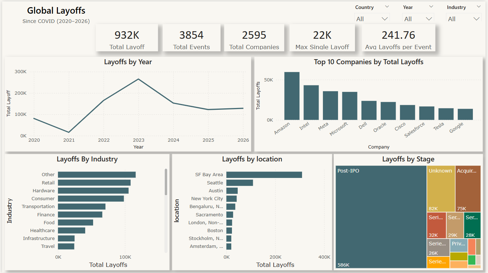

# Global Layoffs Since COVID (2020–2026)

## Objective
Analyze global layoffs since the COVID-19 period to identify trends 
across time, industries, countries, funding stages, and companies — and 
turn raw layoff data into actionable business insights.

## Tools
- MySQL (data cleaning, staging, EDA)
- Power BI (dashboard & visualization)

## Process
1. Data extraction — raw dataset sourced from Kaggle
2. Staging & cleaning — removed duplicates, standardized nulls/blank strings, fixed date formats
3. Exploratory data analysis — 17+ SQL queries covering scale, time trends, companies, industries, geography, and edge cases
4. Dashboard visualization — Power BI dashboard built around key findings
5. Insight synthesis — findings compiled into this report

## Key Findings
1. Layoff sizes were heavily right-skewed — median ~90 vs. average ~310, meaning a small number of massive layoffs pulled the average well above the typical event size.
2. Among clearly named industries, Retail (108K) and Hardware (105K) had the highest total layoffs, ahead of Consumer (98K) and Transportation (71K).
3. The United States accounted for the vast majority of recorded layoffs (660K+), making global trends largely a US-driven story.
4. Post-IPO companies drove the largest share of total layoffs (585K+ across 469 companies), with an average event size (~609) nearly double the dataset-wide average.
5. Amazon had the single largest cumulative layoff total of any company in the dataset.
6. Several well-funded companies (Britishvolt, Quibi, Deliveroo Australia, Fisker, Katerra) shut down entirely (100% layoffs) despite having raised substantial funding.
7. Complete (100%) shutdowns were concentrated among early-stage (Seed) or undisclosed-stage companies, particularly in Finance, Food, and Retail — contrasting with Post-IPO companies, which had high-volume but partial layoffs.
8. January 2023 was the single worst month in the dataset, with ~89,709 layoffs recorded.
9. Layoffs at major tech companies happened in repeated waves rather than one-time events — Amazon (17 separate events), Salesforce (14), Rivian (12), Google (11), and Microsoft (11).

## Dashboard

Interactive Power BI dashboard featuring:
- KPI cards (Total Layoffs, Events, Companies, Max Single Layoff, Avg per Event)
- Layoffs by Year (trend line)
- Top 10 Companies by Total Layoffs
- Layoffs by Industry
- Layoffs by Location (Top 10)
- Layoffs by Stage (treemap)
- Slicers: Country, Year, Industry

## Files
- `cleaning.sql` — data cleaning & staging queries
- `eda.sql` — full EDA query set
- `dashboard.pbix` — Power BI dashboard file
- `screenshots/dashboard.png` — dashboard preview image